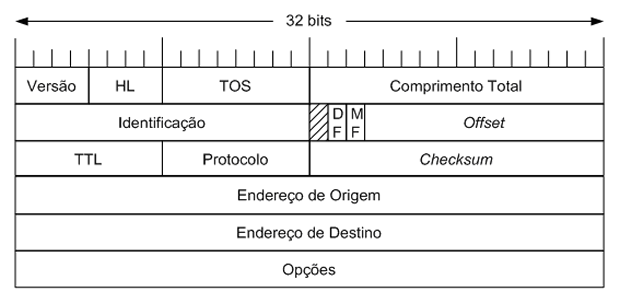

## Cabeçalho de um pacote IP (Internet Protocol)

1. Versão (4 bits)  
    Indica qual versão do protocolo IP está sendo usada.  
    - Valor 4 → IPv4  
    - Valor 6 → IPv6  

2. IHL – Internet Header Length (4 bits)  

    Define o tamanho do cabeçalho.  
    - Unidade: palavras de 32 bits (4 bytes)  
    - Valor mínimo: 5 → 20 bytes  
    - Valor máximo: 15 → 60 bytes  
    Serve pra indicar onde começam os dados (payload).  

3. ToS (Type of Service) / DSCP + ECN (8 bits)  
    Hoje esse campo é dividido em:  
    - DSCP (6 bits) → prioridade/QoS  
    - ECN (2 bits) → sinalização de congestionamento sem descartar pacote  
    Usado em redes que aplicam qualidade de serviço (QoS), muito comum em ambientes corporativos e provedores.  
 
4. Flags (3 bits)  
    Controla fragmentação:  
    - Bit 0 (Reservado) → sempre 0  
    - DF (Don't Fragment)  
        - 0 → pode fragmentar  
        - 1 → NÃO pode fragmentar  
    MF (More Fragments)  
        - 1 → existem mais fragmentos  
        - 0 → último fragmento  

5. Comprimento Total (16 bits)  
    Tamanho total do pacote IP:  
    `cabeçalho + dados`  
    - Mínimo: 20 bytes  
    - Máximo: 65.535 bytes  

6. Identificação (16 bits)  
    Identificador único do pacote.  
    Usado para reagrupar fragmentos quando um pacote é dividido.  

7. Fragment Offset (13 bits)  
    Indica a posição do fragmento no pacote original.   
    Importante:  
    - Unidade: blocos de 8 bytes  
    - Usado junto com:  
        - Identification  
        - Flags  

8. TTL – Time To Live (8 bits)  
    Número máximo de saltos (roteadores).  
    Cada roteador decrementa 1  
    Quando chega em 0 → pacote é descartado  
    > [Important]  
    > Evita loops infinitos na rede.  

9. Protocolo (8 bits)  
    Indica qual protocolo está dentro do pacote IP:  
    - 6 → TCP    
    - 17 → UDP  
    - 1 → ICMP  
    É assim que o sistema sabe para quem entregar o payload.  

10. Header Checksum (16 bits)  
    Verifica erros no cabeçalho.  
    Recalculado a cada roteador (porque o TTL muda)  
    Não cobre os dados, apenas o cabeçalho  

11. Endereço IP de Origem (32 bits): O endereço do remetente.  

12. Endereço IP de Destino (32 bits): O endereço do destinatário.  

13. Opções (variável)  
    Campo opcional (raramente usado).  
    Pode incluir:  
    - Roteamento específico  
    - Timestamp  
    - Segurança  
    Quando usado, aumenta o IHL.

### Explicação

Quando um pacote sai da máquina:

1. Define IP origem/destino
2. Define protocolo (TCP/UDP)
3. Ajusta TTL
4. Se o pacote for grande demais:
    - usa fragmentação (ID + Flags + Offset)
5. Cada roteador:
    - decrementa TTL
    - recalcula checksum